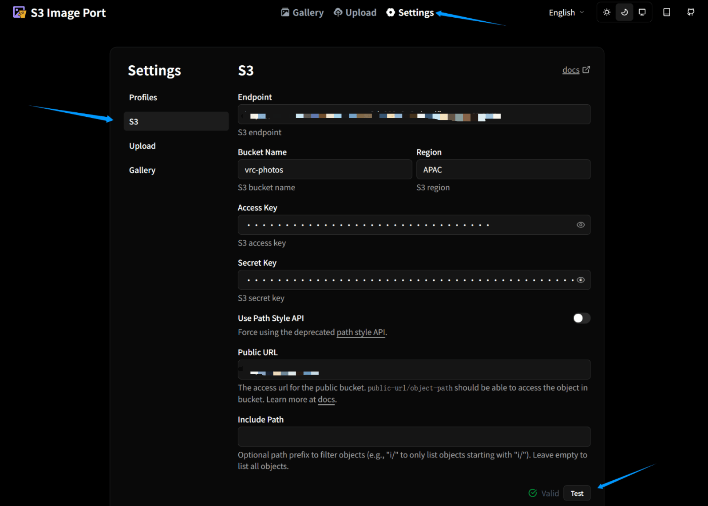

## セルフホスト画像を使う理由

**画像の直リンク**を取得する方法はいろいろあります。最も一般的なのは**画像ホスティングサービスのプラットフォーム**です。便利で、成熟したappがあり、画像を渡すとURLを返してくれます。ただし、それらはあなたの画像を審査するかもしれませんし、あなたの画像を漏らすかもしれませんし、勝手に削除するかもしれません。理由は、この方式でホストされた画像では、あなた自身の画像に対してより大きな制御権を持てないからです。**Cloudflare R2、AWS S3**のような有名クラウドサービスが提供するクラウドストレージを使い、自分で画像ホスティングサービスを構築すれば、サーバーからクライアントまで、自分の画像に対する**全経路の制御**を得られます。VRCアルバムにとっては、それらが提供する**無料枠**ですでに使用需要を満たせます。

ここでは**CloudFlareR2**という一つの方法だけを紹介します。これは私自身が使っている方法でもあります。

## 1. ドメインと R2 のアクセス方法

この方法を使うなら、**自分のドメイン**を持っているのが一番よいです。最も直接的な利点は、画像読み込みが**安定して速く**なることです。同時に、一部のネットワーク制限地域のプレイヤーもあなたの画像を見られる可能性があります。もちろん、R2が提供する開発テスト用ドメインを使っても、**RemotePhotoSystem**方式は正常に動作できます。

CloudFlareの公開**R2バケット**に関するドキュメントでは、**カスタムドメイン**の利点が説明されています：
https://developers.cloudflare.com/r2/buckets/public-buckets/

| 比較項目 | `r2.dev` テストドメイン | カスタムドメイン |
| ----- | ---------------------------------------------------------- | -------------------------------------- |
| 位置付け | 開発 / テスト環境 | 正式な本番環境 |
| ドメイン | ランダムに割り当てられた意味不明なドメイン | `example.com` のような一般的なWebサイト風のドメイン |
| レート制限 | rate limit があり、超過すると一時的に throttled され、`429 Too Many Requests` が返る可能性があります | このレート制限ルールは適用されず、カスタムドメインはCloudFlareプランが提供する高品質なサービスを使用します |
| キャッシュ | 非対応 | Cloudflare Cache によるR2アクセスの高速化に対応 |
| CDN高速化 | 非対応 | CDN高速化に対応し、グローバルアクセスが可能 |
| セキュリティ | とても弱く、カスタマイズできません | CloudFlareのDDoS防御、不正利用対策、AIクローラー制御など、多くのセキュリティ対策を使用します |

ドメインの取得については、**CloudFlare**で直接購入してもよいですし、他のドメインサービス業者から購入してもよいです。私の例では、**NameSilo**で.topドメインを1年$1.88で購入しました。このドメインの更新には毎年$4.88が必要です。


ドメインを入手したら、**CloudFlareでドメインを追加**する案内に従ってドメインをCFへ接続し、その後CFにドメインの**DNS**を完全に管理させ、セキュリティ防御などのスイッチを設定します。心配しなくて大丈夫です。CloudFlareが推奨設定を提示してくれます。

ドメイン購入やCloudFlareへのドメイン接続の過程で何か詰まることがあれば、動画サイトで関連チュートリアルを検索してください。この種の操作には成熟したチュートリアルが多くあります。あるいはCloudFlareやドメインサービス業者のヘルプドキュメントを確認したり、AIに聞いたりしてください。

流れに慣れている開発者向けの短いガイドはこちらです https://imageport.app/en/docs/for-cloudflare-r2


## 2. R2 Bucket を作成する

ようやくR2の段階です。CloudFlareのサイドバーで**R2 Object Storage**を見つけ、**Create Bucket**をクリックします

このbucketに名前を付けます。**Location**があなたのVRCワールドの主なプレイヤーがいる地域かどうか確認してください。違う場合は手動で指定できます。**Default Storage Class**が**Standard**になっていることを確認し、**Create bucket**をクリックします。


## 3. カスタムドメインを紐付ける、または r2.dev を有効化する

おめでとうございます。**R2 Bucket**を作成できました。ただし、まだ画像を急いでアップロードしないでください。**Settings**をクリックします。自分のドメインを購入して紐付けている場合は、**Custom Domains**の**Add**ボタンをクリックし、CFの案内に従ってこのR2 Bucketにドメインを割り当てます。あなたのドメインをVRCアルバムだけに使うつもりではない場合、または将来の開発余地も残したい場合は、R2に**サブドメイン**を割り当ててください。

- サブドメイン：xxxx.your-domian.com
- メインドメイン：your-domian.com


**Add**のボックスでR2用のサブドメインを付けるだけでよいです。画像のように前に**photos**を付ければサブドメインとして判定されます。**Continue**をクリックした後の確認画面で**Connect domain**をクリックし、少し待てば、今はあなたのドメインでR2にアクセスできるはずです。

先にR2の開発テスト用ドメインを使いたい場合は、**Public Development URL** の後ろにある **Enable** をクリックする必要があります。このとき確認ウィンドウが表示され、入力欄に**allow**と入力して**Allow**ボタンをクリックします。これで**.r2.devドメイン**を取得できるはずです。

## 4. 画像管理方法

次は画像をアップロードします。ただしアップロードの前に、R2のストレージバケットの画像管理画面は下の画像のような**純粋なディレクトリ構造**であり、**画像を視覚的に操作する画面**がないことを知っておく必要があります。画像管理をスムーズに行うために、私はこれをおすすめします：


> **S3 Image Port** ——A dashboard to manage your images in S3 buckets. 

https://github.com/yy4382/s3-image-port


**S3 Image Port**はこのような直感的な操作画面を提供し、R2と直接連携できます。S3 Image Portで画像の**アップロード/削除**ができ、アップロード前の**画像圧縮**にも対応しているため、保存容量を節約し、ネットワーク転送にも有利です。さらに、**どんなプログラムもダウンロードする必要はありません**。これは**静的フロントエンドアプリケーション**で、https://imageport.app/ にアクセスすれば直接使えます。あなたのR2認証情報は**ブラウザローカル**に保存されるか、暗号化してリモートRedisサービスへ同期できます。S3 Image Port自体は**画像を保存せず、画像配信も担当せず、完全にバックエンドを持ちません**。

この文書の完成時点では、S3 Image Portにはまだ**URLs一括コピー機能**が追加されていません。**RPS Webツール**との接続を便利にするため、私のブランチを使うことを検討できます https://github.com/thok404/s3-image-port/tree/feature/gallery-bulk-actions   **==このブランチには設定ファイル同期機能がありません==**

**直接使用できるWebアプリ：** https://imageport.thok.top/

簡潔なS3 Image Port公式ガイドも確認できます https://imageport.app/en/docs/for-cloudflare-r2

> **重要な訂正：** API Token の権限は **Object Read & Write** ではなく、**Admin Read & Write** を選択してください。

下の画像付きチュートリアルも確認できます
## 5. R2 CORS を設定する


まずR2がS3 Image Portからアクセスされることを許可します。**R2 Settings**ページに戻り、**CORS Policy**を見つけ、**Add**をクリックし、表示されたコードボックスの内容をすべて削除して、次に置き換えます：

```
[
  {
    "AllowedOrigins": ["https://imageport.thok.top"],
    "AllowedMethods": ["GET", "PUT", "DELETE", "HEAD", "POST"],
    "AllowedHeaders": ["*"]
  }
]
```

その後**Save**をクリックします。これであなたのR2は**imageport.thok.top**からのリクエストを受け付けられます。元プロジェクトのmainブランチを使う場合は、下のコードを使ってください。

```
[
  {
    "AllowedOrigins": ["https://imageport.app"],
    "AllowedMethods": ["GET", "PUT", "DELETE", "HEAD", "POST"],
    "AllowedHeaders": ["*"]
  }
]
```

## 6. R2 API Token を作成する


R2の**Overview**パネルに戻り、**Account Details → API Tokens → Manage**を見つけます。必要に応じてAccount/Userトークンを選びます。この例では**Create Account API token**をクリックして説明します。


**Token name**を付けます。Premissionsは**Admin Read & Write**を選びます。TTLは好みに応じて設定し、この例では**Forever**を使います。Client IP Address Filteringは空のままにし、**Create Account/User API Token**をクリックします

> S3 Image Portの設定を完了するか、すべてのKeyを記録するまで、このページを閉じないでください


For security reasons, these token values will not be shown again. [Learn more about API token generation](https://developers.cloudflare.com/r2/api/s3/tokens/)

## 7. S3 Image Port に接続する

次にS3 Image Portの**Settings → S3**ページに入ります



- **Endpoint**：先ほどのAPI TokenページにあるUse jurisdiction-specific endpoints for S3 clients:リンクを入力
- **Bucket Name**：your-bucket-name
- **Region**：R2 Bucket → Settings → General → Location   またはデフォルト値autoを使用


- **Access Key**：API Tokenページの Access Key ID
- **Secret Key**：API Tokenページの Secret Access Key
- **Public URL**：R2に関連付けたCustom DomainまたはPublic Development URL。https://で始まる必要があります

その後**Test**ボタンをクリックし、**Valid**が表示されれば設定完了です

**S3 Image PortとR2の紐付けがようやく完了しました**

これで**Profiles**ページに切り替え、**Rename**をクリックしてこの設定ファイルに新しい名前を付けられます


S3 Image Portのブランチを切り替えたい場合や、他のブラウザ・デバイスを使いたい場合などは、上記の紐付け手順を再度実行する必要はありません。**Export**をクリックしてJSONをクリップボードへエクスポートし、好きな文書に保存しておけば、次回はそのJSONをクリップボードへコピーし、Profilesページ右上の**Import Profile**をクリックするだけでよいです。


## 8. 画像をアップロードして URL をコピーする

**SettingsのUploadページ**では、画像アップロード時のいくつかの動作が決まります。私の**Default Key template**には**{{filename}}**だけを入力しています。これは、アップロードされる画像のデフォルト命名テンプレートがファイル名だけであることを意味します。つまり、アップロード後の画像名はローカルの画像名と一致します。説明が少し冗長ですが、数枚アップロードしてパスを見れば理解できるはずです。上のdocsリンクでは各Keyの使い方が説明されています

**Image convertion and compression**はフォーマット変換と画像圧縮ができます。ネットワーク経由で画像を送る用途（**VRC RemotePhotoSystem**）では、**JPEG形式を使って圧縮する**ことをおすすめします

ナビゲーションの**Upload**をクリックし、数枚画像をアップロードし、**Gallery**に戻って少し更新すると、R2上の画像が目の前に表示されるはずです。

あとは直感で操作できます。左上には**全選択ボタン**があり、画像を選択すると**全選択解除、選択したURLsをコピー、選択した画像を削除**が表示されます（これはR2 Bucket内の画像を削除します）。左下では1ページあたり20、50、100枚表示を切り替えられ、画像をダブルクリックすると単体画像ビューに入れます。

**全選択+選択したURLsをコピー機能**により、[RemotePhotoSystemWebtool](webtool.md)へ素早く接続できます。これが私たちがそれを使う理由でもあります。
