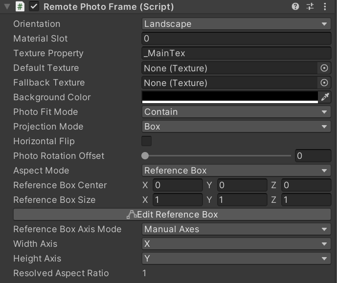
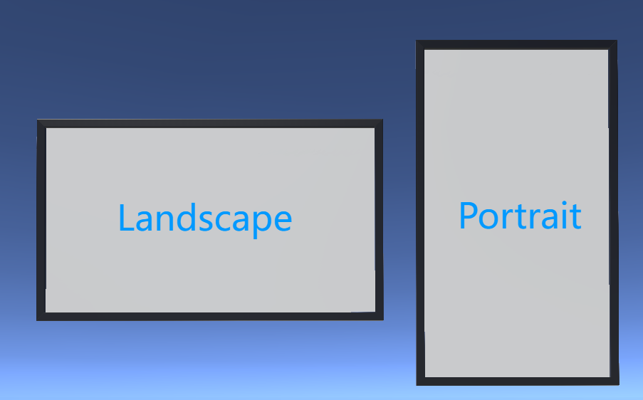

# RemotePhotoFrame

RemotePhotoFrame 用于配置一个相框，并调整图片的显示方式。

> 该组件必须放在显示照片的网格物体上。
>
> 推荐使用 UV 归一化的单面 Plane 作为照片显示网格。
>
> 照片显示网格必须使用本项目附带的 Shader。

## 基础设置

| 参数 | 说明 |
|---|---|
| Orientation (图片方向池) | 设置相框的构图方向。根据实际相框选择 Landscape 或 Portrait。 |
| Material Slot (材质槽位) | 选择用于显示图片的材质槽位，从 0 开始计数。只有一个材质时通常不需要修改。 |
| Texture Property (贴图属性名) | 材质 Shader 中主贴图槽的名称。因为本项目使用专用 Shader，通常保持 `_MainTex` 即可。 |

## 图片显示

| 参数 | 说明 |
|---|---|
| Default Texture (默认贴图) | 远程链接加载前显示的图片。留空不会影响系统。 |
| Fallback Texture (回退贴图) | 远程图片加载失败后显示的图片。留空不会影响系统。 |
| Background Color (背景颜色) | `Contain` 留出的空边和 `Box` 模式侧边填充使用的背景颜色。 |

## 适配与投射

| 参数 | 说明 |
|---|---|
| Photo Fit Mode (图片适配模式) | 提供常见的图片适配方式。 |
| Projection Mode (投射模式) | 选择照片贴图的投射方式。 |
| Horizontal Flip (水平翻转) | `Box` 投射有时会水平镜像，启用该选项可修正。 |
| Photo Rotation Offset (图片旋转补偿) | 在照片最终显示前添加额外旋转。通常保持 0，除非需要修正问题或制作特殊效果。 |

### Photo Fit Mode

| 选项 | 说明 |
|---|---|
| Crop | 裁掉超出相框的部分，不改变保留画面的比例。 |
| Contain | 缩放图片，让整张图都进入相框，并留下空边。 |
| Stretch | 忽略图片比例，将图片拉伸填满相框。 |
| Tile | 保持原图尺寸，并在相框内重复平铺。 |

### Projection Mode

| 选项 | 说明 |
|---|---|
| Mesh UV | 适合单面网格。推荐照片显示网格使用单面 Plane。 |
| Box | 适合立方体网格。该模式会检测立方体尺寸，舍弃最短边，并用剩下两条尺寸建立投射平面。实际使用时，请把照片网格做成扁平相框状立方体。 |

> 其他几何体类型尚未测试。请只使用单面 Plane 或六面立方体网格。

## 比例计算

| 参数 | 说明 |
|---|---|
| Aspect Mode (画幅比例模式) | 切换图片显示比例的计算方式。 |
| Reference Box Axis Mode (Reference Box 轴向模式) | 在 Reference Box 模式中，选择如何使用参考框计算比例。 |
| Resolved Aspect Ratio (最终宽高比) | 显示最终应用的比例。 |

### Aspect Mode

| 选项 | 说明 |
|---|---|
| Manual | 强制使用 `Manual Aspect Ratio` 中输入的比例。只在明确知道需要什么比例时使用。 |
| Auto | 从网格边界自动计算比例。通常推荐使用。 |
| Reference Box | 提供一个像 BoxCollider 一样编辑的盒子。用这个盒子包住相框。 |

### Reference Box Axis Mode

| 选项 | 说明 |
|---|---|
| Auto | 像立方体投射一样舍弃最短边，并用剩下两条边计算比例。 |
| Manual Axes | 手动选择用于计算比例的两条轴。 |
