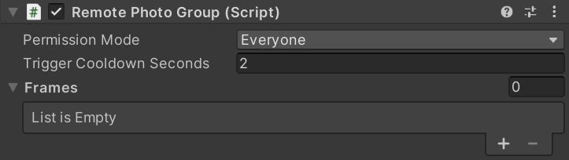

***RemotePhotoGroup***用于设定每组的交互权限、按钮冷却时间以及连接相框。

## 参数

**Permission Mode(触发权限) :** 谁被允许与这个组交互，有Everyone/Owner Only/Master Only三种权限选择，对于大多数情况选择Everyone
**Trigger Cooldown Seconds(触发冷却秒数) :** 触发换相片事件后允许下一次触发的间隔秒数，可以理解为连续点击按钮的间隔时间

**Frames (相框):** 管理连接到此组的相框(带有RemotePhotoFrame组件的游戏对象)，只有被添加进受RemotePhotoManager管理的组的相框才会生效。**此项中相框的排列顺序决定从画廊中取图的前后顺序**，如果你的场景中相框按顺序排列，在此处也按相同的顺序排列以获得更好的体验

## 事件

TriggerRandom() : 触发随机换图，只在随机模式有效
TriggerPrevious() : 向上换图翻页，只在顺序/倒序模式有效
TriggerNext() : 向下换图翻页，只在顺序/倒序模式有效